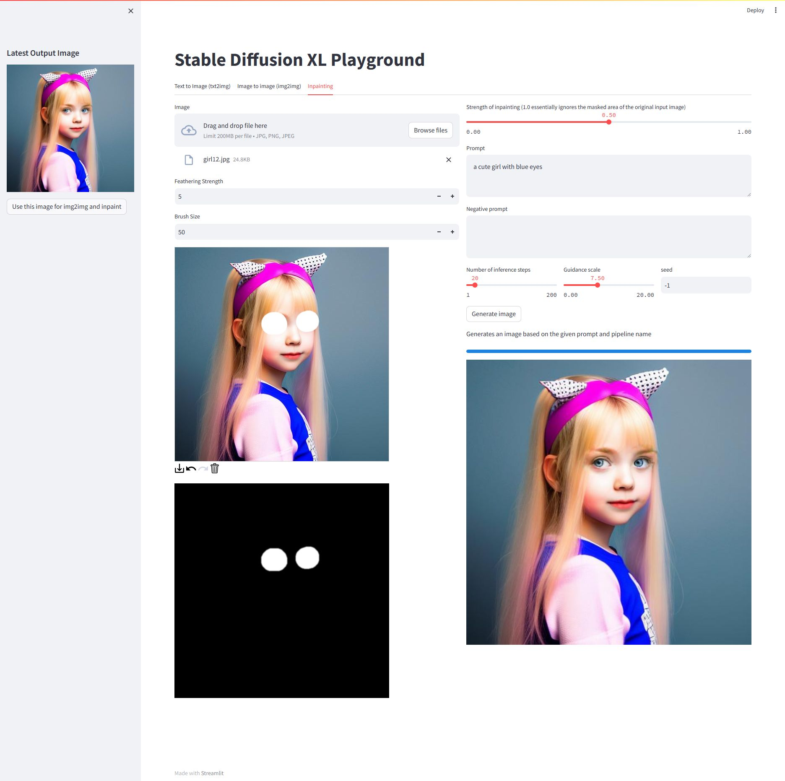

# minSDXLTF

Stable Diffusion XL Inference With PyTorch Weights And More Features Like Stable Diffusion Web UI In Keras 3.x

## Why do this?

While huggingface `diffusers` and AUTOMATIC1111 `webui` library is amazing, nowdays, its implementation has gotten
extremely big and unfriendly for people who want to build on it. I've always wished that an implementation existed that
was not only easy to learn but also easy to maintain and develop. so, I did this project. It's like building a bridge
that is compatible with the resources of the active PyTorch community, but at the same time will have the multiple
features of Keras/TensorFlow.

<div style="width: 100%; text-align: center; margin:auto;">

</div> 

#### Using pip without a virtual environment

Install dependencies using the `requirements.txt` file:

```bash
pip install -r requirements.txt
```
#### Run

```
streamlit run app.py
```
### Using the Python interface

If you installed the package, you can use it as follows:

```python  
from PIL import Image

from stable_diffusion_xl.stable_diffusion_xl import StableDiffusionXL

# load ckpt from local path
model = StableDiffusionXL(img_height=1024, img_width=1024, jit_compile=True,
                          unet_ckpt="/path/to/unet.safetensors",
                          vae_ckpt="/path/to/vae.safetensors",
                          text_encoder_ckpt="/path/to/text_encoder.safetensors",
                          text_encoder2_ckpt="/path/to/text_encoder2.safetensors")
img = model.text_to_image(
  "a cute girl.",
  num_steps=25,
  seed=123456)
Image.fromarray(img[0]).save("out.jpg")

# for Image To Image
model = StableDiffusionXL(img_height=1024, img_width=1024, jit_compile=True)
img = model.image_to_image(
  "a cute girl.",
  reference_image="/path/to/a_girl.jpg",
  reference_image_strength=0.8,
  num_steps=50,
)
Image.fromarray(img[0]).save("out.jpg")

# for Inpaint
model = StableDiffusionXL(img_height=1024, img_width=1024, jit_compile=True)
img = model.inpaint(
  "A dog with sunglasses, wearing comfy hat, looking at camera, highly detailed, ultra sharp, cinematic, 100mm lens, 8k resolution.",
  reference_image="/path/to/dog.jpg",
  inpaint_mask="/path/to/dog_mask.png",
  mask_blur_strength=5,
  unconditional_guidance_scale=8.0,
  reference_image_strength=0.9,
  num_steps=50,
)
Image.fromarray(img[0]).save("out.jpg")
```

* TODO
    - [x] Load Pytorch Weights 
    - [x] Image To Image
    - [x] Inpainting
    - [x] Long Prompt Weighting
    - [x] CFG Rescale
    - [x] ~~LCM Scheduler~~
    - [x] TCD Scheduler
    - [ ] Lora
        - [ ] Merge
        - [ ] Switch
    - [ ] Refiner
    - [ ] Outpainting
    - [ ] Upscaler
    - [ ] Highres Fix
    - [ ] Face Restoration
    - [ ] Sampler
    - [ ] Flash Attention
    - [ ] Multi-language Prompt
    - [ ] Gui
    - [ ] Cache Manager
    - [ ] Latent Consistency Model Converter

Distributed under the MIT License. See `LICENSE` for more information.

## Credits

Licenses for borrowed code can be found in following link: 

- KerasCV - https://github.com/keras-team/keras-cv
- Diffusers - https://github.com/huggingface/diffusers
- Stable Diffusion Web UI - https://github.com/AUTOMATIC1111/stable-diffusion-webui
- Stable Diffusion 2 XL Streamlit https://github.com/dlebech/stable-diffusion-2-xl-streamlit/

## Models

- Stable Diffusion XL Base 1.0 - https://huggingface.co/stabilityai/stable-diffusion-xl-base-1.0 

## Reach me on

   - [](https://t.me/cpuimage)
   - 
   -  
   - [](mailto:gaozhihan@vip.qq.com)

## Donating

If this project useful for you, please consider buying me a cup of coffee or sponsoring me!

<a href="https://paypal.me/cpuimage/USD10" target="_blank"></a>
